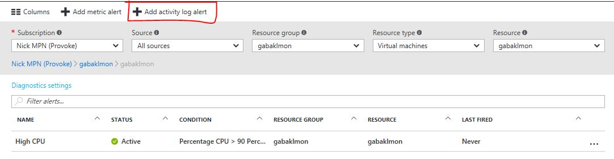

# Monitoring and Security in Azure #
---

## Overview ##
Once you've built and configured your virtual machines, websites, databases and other services within your Azure subscription, it's important to keep an eye on things to ensure your services are running as well as you expect and that they aren't vulnerable to attacks which could interrupt service. Even though the Azure platform is hosted in some of the most stable, secure and performant datacenters in the world, this doesn't mean that your solution is automatically bulletproof - it's still your responsibility to ensure your services running on Azure are performing well. Luckily for us though, there are some great tools available directly in Azure which allow us to easily keep an eye on things. We'll be covering these in the following excercises :
- Azure Monitor
- Azure Security Center
- Log Analytics (Operational Management Suite)

Each of the above services has its own core focus but offers overlapping functionality to the others available. 

### Objectives ###
In this hands-on lab, you will learn how to:
- Enable collection and monitoring of performance metrics
- Investigate administrative activity against Azure resources
- Create service health dashboards
- Set up alerts
- Investigate potential security vulnerabilities in your environment
- Extend basic Azure monitoring with OMS
- Use Log Analytics and the OMS dashboard 

### Prerequisites ###
The following are required to complete this hands-on lab:
- An active Microsoft Azure subscription, or [sign up for a free trial](https://azure.microsoft.com/en-us/free/)

## Exercises ##
- [Exercise 1: Create a VM and discover basic Azure performance metric monitoring capabilities](#Exercise1)
- [Exercise 2: Extend performance metric monitoring with the Azure Diagnostics](#Exercise2)
- [Exercise 3: Create a service health dashboard](#Exercise3)
- [Exercise 4: Alerting on performance thresholds](#Exercise4)
- [Exercise 5: Identifying security vulnerabilities](#Exercise5)
- [Exercise 6: Adding more functionality with OMS](#Exercise6)
- [Exercise 7 (if you have time): Explore the OMS Experience Center](#Exercise7)

Estimated time to complete this lab: **60 minutes**.

## Exercise 1: Create a VM and discover basic Azure performance metric monitoring capabilities
In this exercise, you will use the [Azure Portal](https://portal.azure.com) to create a new Virtual Machine and explore the default metrics and views available for monitoring.
1. Open the [Azure Portal](https://portal.azure.com) in your browser. If you are asked to log in, do so using your Microsoft account.
 
1. Click **+ New** in the ribbon on the left. Then click **Storage**, followed by **Storage account**.

_Creating a Windows Server VM_

1. In the blade which pops up, ensure you select "Resource Manager" as your deployment model, then click **CREATE** 

_Resource Manager Deployment Model selected_

1. In the ensuing "Create virtual machine" blade, on the **Basics** tab, enter a name for the new virtual machine in **Name** field and in the **VM Disk Type** dropdown, select SSD.
1. Enter a user name and password into the fields shown. **MAKE A NOTE** of these values as we'll be needing them to access this machine later
1. In the **Resource Group** field, select **Create New** and enter a new resource group name
1. For the "Already have a Windows Server license" field, select **No**
	

_Specifying basic parameters for a new virtual machine_
1. On the "Choose a size" blade, select **DS1_V2** 

_Selecting VM Size_
1. On the "Settings" blade, select **YES** under **Storage... Use Managed Disks**
1. Under the "Monitoring" section, ensure Boot Diagnostics is ENABLED and Guest OS diagnostics is DISABLED. All other settings can retain their default values.

_Selecting VM Settings_

1. Click **OK** then on the Summary screen, once validation passes, click **OK** to create the new virtual machine

_Confirm summary to begin creation_

The VM creation process will take a few minutes and you can check on progress by clicking the "Virtual Machines" icon in the resources menu on the left (where you'll then see your new machine as having a status of "Creating"), or you can click the Notifications icon at the top right where you will see your deployment in progress.

_Checking deployment progress_

Once the build is completed and the machine is listed as "Running", click on it to bring up the Overview blade. Here you'll notice four default performance metrics being monitored, namely:
- CPU
- Network
- Disk bytes
- Disk operations

>These metrics are available because they are able to be determined by the physical host machine running this virtual machine. In order for us to get a better understanding of how well this VM is performing though, we'll need to enable collection of metric data from WITHIN the VM itself - that's the focus of Exercise 2.

_Default metrics available_

1. Click "Check More Metrics in Azure Monitor" to see ALL the metrics we are currently able to monitor
The Azure Monitor blade opens and as you can see, in the "Resource" dropdown at the top right, it is scoped to our new VM.
You'll also notice that there are actually 7 rather than 4 metrics available, all of them determined by the Host rather than from within the VM itself. This is specified by the word "[Host]" before the metric name.
1. Go ahead and toggle different metrics on and off and also change the Chart type and Time range to see the effect on the graphed data.

_Explore the Azure Monitor interface and available metrics_

## Exercise 2: Extend performance metric monitoring with the Azure Diagnostics
In this exercise, you will use the [Azure Portal](https://portal.azure.com) to enable guest metric collection from within a Virtual Machine.
1. Open the [Azure Portal](https://portal.azure.com) in your browser. If you are asked to log in, do so using your Microsoft account.

1. From the portal, in the menu on the left click the Virtual Machines icon
1. Find and click the machine we created in Exercise 1 above
1.  Scroll down and click "Diagnostic Settings"
1. Click "Enable guest-level monitoring"

_Enabling guest-level monitoring_

> What will now happen, is that a piece of software called an agent is installed in the virtual machine. This agent collects performance metric data and uploads it into Azure storage. Installing the agent usually takes a few minutes.

1. Wait until you receive a notification that the diagnostic settings update has been completed.

_Diagnostics settings update complete_

1. Confirm agent installation by checking the Extensions setting in the VM menu

_Agents have been installed_

1. Now, we should be able to access many more metrics... Take a look by scrolling down and clicking **Metrics** under the Monitoring section

_Many more metrics now available_

>You may notice if you select to view one of the metrics that a message "No Data Could be Loaded" appears... this is because no metric data has been collected yet since the agent has only recently been installed. Ensure **Time Range** is set to "past hour" to provide the most granularity then give it a few minutes and try toggling the metric checkbox (such as Memory\Available Bytes) off and on again.

1. Explore the new performance metrics available by toggling them on and off

## Exercise 3: Create a service health dashboard
In this exercise, you will use the [Azure Portal](https://portal.azure.com) to set up a service monitoring dashboard displaying service metrics.
1. Open the [Azure Portal](https://portal.azure.com) in your browser. If you are asked to log in, do so using your Microsoft account.

> Wherever you are in the Azure Portal, clicking the "Microsoft Azure" text in the top right of the screen will take you back to your dashboard. Every subscription has a default dashboard which has tiles for Service Health, Marketplace, Portal Settings and perhaps links to various services you have created. 
> As well as this default dashboard, we are able to create other dashboards which we can use to provide a snapshot glance at a particular solution's performance and availability.

1. Click the **Microsoft Azure** text at the top left of the Azure portal to be taken to your default dashboard view
1. Now click "+ New dashboard"

_Add a new dashboard_

1. In the dashboard editor that appears, update the title at the top to "My GAB Akl Services"
1. Click the **Markdown** tile on the left and drop it onto the dashboard
1. Modify the **Edit Markdown** window as shown in the screenshot below. Copy and Paste the following text as Content:

	__My GAB Services__
	
	This dashboard will show us performance and availability of our services.
	content/uploads/2016/09/2017-logo-250x169.png">
	

1. Click Update
1. Click Done customizing
1. In the menu on the left, click the VMs icon, then find the VM we created above in the list that appears
1. click the **...** icon to the right and in the popup menu, click **Pin to dashboard**
This will add a shortcut to our VM onto the dashboard we're creating

_Pin a VM to our dashboard_

1. Click on the VM top open the settings pane
1. Scroll down and click on Metrics under Monitoring
1. Select the checkbox for [Host] Percentage CPU
1. Ensure Time Range is set to Past Hour
1. Click Pin to Dashboard

_Pin CPU Metric to dashboard_

1. Repeat the above steps to also pin the metric **\Memory\Available Bytes**
1. Open your new dashboard again by clicking the **Microsoft Azure** text at the top left of the Portal
1. Rearrange your dashboard components by dragging and dropping to make it easier to read. Click Done Customizing when complete.

_Rearranged dashboard tiles_

## Exercise 3: Alerting on performance thresholds
In this exercise, you will use the [Azure Portal](https://portal.azure.com) to set up alerts whenever performance thresholds are exceeded.
First, we're going to add an alert to fire whenever the CPU utilisation for our virtual machine is too high
1. Open the [Azure Portal](https://portal.azure.com) in your browser. If you are asked to log in, do so using your Microsoft account.
1. From the left menu, select the VM icon and navigate to the virtual machine you created above
1. In the VM settings menu, scroll down to **Alert rules** under the Monitoring section
1. Click **Add metric alert**

_Add a new metric alert_

1. in the "Add rule" blade which appears, 
	- Enter a name for this rule (e.g. High CPU)
	- Enter a description (e.g. Alert when CPU > 50%)
	- The criteria for subscription, resource group, and resource should already be scoped to the VM we're working with so you shouldn't need to change them
	- For Condition, select **Greater than**
	- For Threshold, enter 50
	- For Period, select **Over the last 5 minutes**
	- For **Additional administrator email(s)**, enter in your personal email address
1. Click OK

_Add a new metric alert rule_

You should now see the metric rule added to the list

_New alert added_

> So that was adding an alert to fire based on some metric performance data reaching a threshold... you could add other metric alerts such as free disk space approaching zero to prevent against your VM crashing
>There is another type of alert too, called an **Activity Log Alert**... this type of alert triggers when some sort of action happens to a resource you have in Azure.

Let's set up an Activity Log Alert to email us whenever our VM is restarted

1. In the Alerts area, click the button to **Add a new log activity alert**

_New activity alert_

1. In the "Add activity log alert" blade which pops up, enter the following:
	- Activity log alert name: VM Restart Alert
	- Description: Alerts me whenever my VM is restarted
	- Subscription: (your subscription)
	- Resource group: Default-ActivityLogAlerts (to be created)
	- Event criteria: Administrative
	- Resource type: Virtual machines (Microsoft.Compute/VirtualMachines)
	- Resource group: gabaklmon (the group containing your VM)
	- Resource: gabaklmon (the name of your VM)
	- Level: All
	- Status: All
	- Action group name: Admin Users
	- Short name: Admin Users
	- Name: (Your name)
	- Action Type: Email
	- Details: (your email address)

1. Click OK

_RDP to your VM_

>  You'll notice the activity log alert isn't shown in the list of alerts here - that's expected.

Let's test out our alerts!
We need to generate some load on our VM to get CPU above 90%, so to do that:

1. From the Overview blade in your virtual machine settings, click on Connect, then Open the RDP file

_RDP to your VM_

1. Enter the credentials you provided when you first built the VM in Exercise 1

1. From within the VM, check that IE ESC is turned OFF from Server Manager

_Turn OFF IE ESC_

1. Next, open Internet Explorer and download the following file https://gabakl.blob.core.windows.net/resources/loadgen.ps1
1. Right-click the downloaded file and select "Run with PowerShell"

_Run loadgen.ps1_

Memory and CPU load will be generated so we can see our performance stats and test out our alerts

1. Click on the "Microsoft Azure" text in the top left of the portal to be taken back to our dashboard
1. We should soon start seeing the effect of the script reflected in our graphs

_High CPU, Low Available Memory_

1. Check your email after 5 minutes too as you should also have received an alert that CPU has been too high on our VM

_Alert Triggered_

Let's get our VM back to normal by rebooting it

1. Click the VM shortcut from the dashboard

_Click back into our VM_

1. Click **Restart**

_Restart VM_

1. Check your email again... you should now also have an activity alert email from the rule we added earlier

_Alert Triggered_

> When you have many services and resources in your Azure subscription, it can be cumbersome to have to go into each resource individually to check its metrics and manage alerts. Handily, there is a service
> in Azure known as **Azure Monitor** which brings all this functionality together in one place. Take 5 minutes to explore how Azure Monitor consolidates this information.

1. In the left menu of the Azure portal, click on the Monitor icon
1. Explore the following areas
	- Activity log: shows you all the actions that have happened against your Azure resources
	- Metrics: shows performance metric data for any resource across all your subscriptions
	- Alerts: shows a consolidated view of metric and activity alerts (see the two we added earlier?)

_Explore Azure Monitor_

